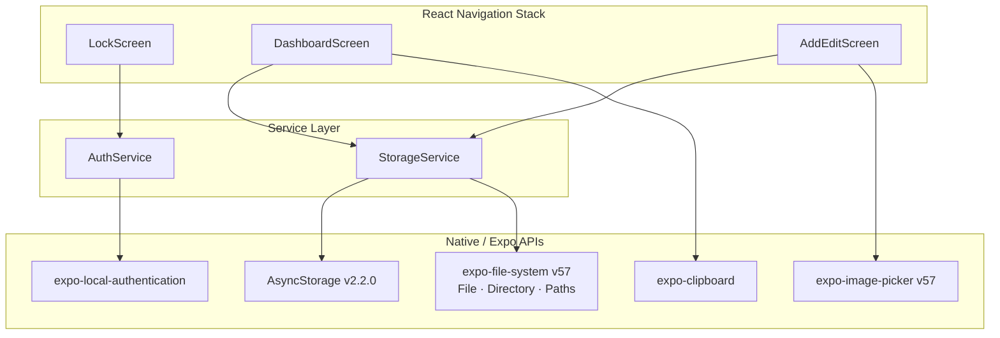
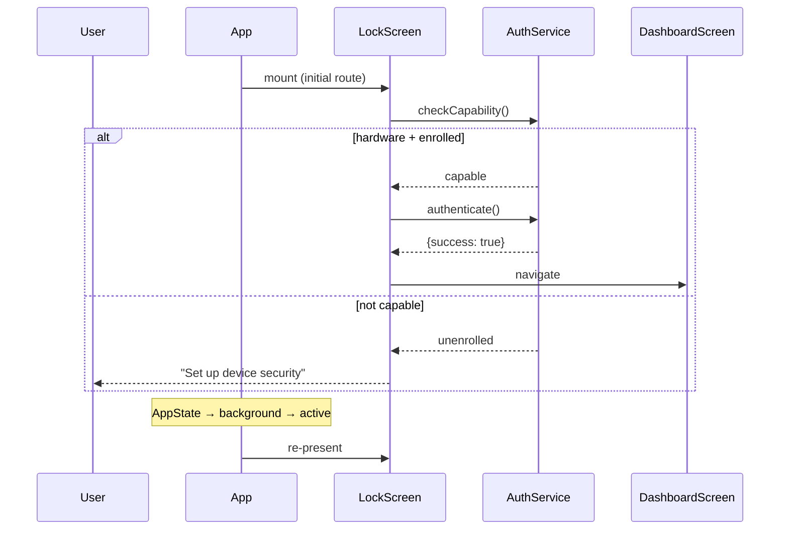

# Design Document — Sinop Vault

## Overview

Sinop is an offline-first, biometric-gated Personal Document & ID Vault built with Expo SDK 57
(React Native 0.86, React 19.2). All data — both metadata and photo files — lives entirely on the
device. No network calls are ever made for Vault operations.

The application has three screens connected by a stack navigator:

1. **LockScreen** — shown on every launch and every foreground resume; blocks access until the
   device's biometric or PIN challenge is passed.
2. **DashboardScreen** — lists all stored ID cards in a dark-themed wallet UI.
3. **AddEditScreen** — creates or updates a single ID entry, with optional photo attachment.

Two service modules sit beneath the screens:

- **AuthService** (`services/AuthService.js`) — wraps `expo-local-authentication`.
- **StorageService** (`services/StorageService.js`) — wraps
  `@react-native-async-storage/async-storage` and `expo-file-system` v57's class-based API.

### Key Design Decisions

| Decision | Rationale |
|---|---|
| All data on-device only | Privacy requirement; no server needed |
| `expo-file-system` class-based API only | Legacy procedural API throws at runtime in SDK 57 |
| `Paths.document` for photos | OS never purges this directory; survives restarts |
| `mediaTypes: ['images']` string array | `MediaTypeOptions` enum is removed in SDK 57 |
| Auth re-challenge on every foreground resume | Prevents shoulder-surfing after phone unlock |
| Service layer isolates native APIs | Screens never import AsyncStorage / expo-file-system / expo-local-authentication directly |

---

## Architecture



### Navigation Flow



---

## Components and Interfaces

### Component Tree

```
App (navigator root)
├── LockScreen
│   └── BlurPreviewPlaceholder
├── DashboardScreen
│   ├── IDCard  (× n)
│   │   ├── MaskedIDNumber
│   │   └── ExpiryBadge
│   └── FAB "Mag-sinop ng Bagong ID"
└── AddEditScreen
    ├── TextInput (Name)
    ├── TextInput (ID Type)
    ├── TextInput (ID Number)
    ├── DateInput (Expiry Date, optional)
    └── PhotoPicker (camera | library)
```

### AuthService Interface

```js
// services/AuthService.js
import * as LocalAuthentication from 'expo-local-authentication';

/**
 * Check whether the device has suitable hardware AND an enrolled credential.
 * @returns {Promise<{capable: boolean, reason?: 'no_hardware'|'not_enrolled'}>}
 */
export async function checkCapability() { ... }

/**
 * Prompt the user for biometric or PIN authentication.
 * PIN fallback is always enabled (disableDeviceFallback: false).
 * Only call this after checkCapability() confirms capable === true.
 * @param {string} promptMessage
 * @returns {Promise<import('expo-local-authentication').LocalAuthenticationResult>}
 *   { success: true } | { success: false, error: LocalAuthenticationError }
 */
export async function authenticate(promptMessage) { ... }
```

### StorageService Interface

```js
// services/StorageService.js
import AsyncStorage from '@react-native-async-storage/async-storage';
import { File, Directory, Paths } from 'expo-file-system';

/**
 * Persist a new ID entry. Generates a uuid-style id.
 * @param {IDEntryInput} entry
 * @returns {Promise<IDEntry>} the saved entry including generated id
 * @throws {StorageError} if AsyncStorage write fails
 */
export async function saveEntry(entry) { ... }

/**
 * Load all valid ID entries from AsyncStorage.
 * Corrupt records are silently skipped; missing photo files are surfaced
 * via entry.photoMissing = true rather than omitting the card.
 * @returns {Promise<IDEntry[]>}
 */
export async function loadEntries() { ... }

/**
 * Update an existing entry by id, preserving the original id.
 * @param {string} id
 * @param {Partial<IDEntryInput>} updates
 * @returns {Promise<IDEntry>}
 * @throws {StorageError} if AsyncStorage write fails
 */
export async function updateEntry(id, updates) { ... }

/**
 * Delete an entry's metadata from AsyncStorage, then best-effort
 * delete the associated photo file (failure is silent).
 * @param {string} id
 * @returns {Promise<void>}
 * @throws {StorageError} if AsyncStorage removal fails
 */
export async function deleteEntry(id) { ... }

/**
 * Copy a photo from the image-picker's temporary URI to Paths.document.
 * Uses the class-based expo-file-system v57 API exclusively.
 * @param {string} pickerUri  — the asset URI returned by expo-image-picker
 * @returns {Promise<string>} the permanent Paths.document-based URI
 * @throws {FileSystemError} if copy fails
 */
export async function copyPhotoToVault(pickerUri) { ... }

/**
 * Delete a photo file from Paths.document. Errors are swallowed.
 * @param {string} vaultUri
 * @returns {Promise<void>}
 */
export async function deletePhoto(vaultUri) { ... }
```

---

## Data Models

### IDEntry (AsyncStorage schema)

```js
/**
 * Stored as JSON under AsyncStorage key:
 *   SINOP_VAULT_ENTRIES  →  JSON.stringify(IDEntry[])
 *
 * @typedef {Object} IDEntry
 * @property {string}      id          - UUID v4, generated on first save
 * @property {string}      name        - Human-readable label (required)
 * @property {string}      idType      - Type of document, e.g. "PhilSys ID" (required)
 * @property {string}      idNumber    - Raw ID number, unmasked (required)
 * @property {string|null} expiryDate  - ISO 8601 date string "YYYY-MM-DD" or null
 * @property {string|null} photoUri    - Paths.document-based file:// URI or null
 * @property {number}      createdAt   - Unix timestamp ms
 * @property {number}      updatedAt   - Unix timestamp ms
 */
```

**AsyncStorage key layout:**

| Key | Value |
|---|---|
| `SINOP_VAULT_ENTRIES` | `JSON.stringify(IDEntry[])` — entire vault as a JSON array |

A single key holding the full array is appropriate for the expected data size (dozens of entries,
not thousands). A per-entry key scheme would be considered if the vault grew large, but for this
use case a single serialised array simplifies atomic writes and avoids key enumeration complexity.

### Navigation Param Types

```js
// AddEditScreen receives one param:
//   { mode: 'add' }
//   { mode: 'edit', entry: IDEntry }
```

---

## Key Algorithms

### ID Number Masking

```js
/**
 * Mask an ID number so only the last 4 characters are visible.
 * For strings shorter than 4 characters, no masking is applied.
 *
 * maskIdNumber("123456789") → "•••••6789"
 * maskIdNumber("1234")      → "1234"   (≤ 4 chars, no mask)
 * maskIdNumber("")          → ""
 *
 * @param {string} idNumber
 * @returns {string}
 */
export function maskIdNumber(idNumber) {
  if (idNumber.length <= 4) return idNumber;
  const masked = '•'.repeat(idNumber.length - 4);
  return masked + idNumber.slice(-4);
}
```

### Expiry Check

```js
/**
 * Returns true if the given ISO date string is strictly before today
 * (device local date, compared at midnight).
 *
 * @param {string} isoDate  "YYYY-MM-DD"
 * @returns {boolean}
 */
export function isExpired(isoDate) {
  const today = new Date();
  today.setHours(0, 0, 0, 0);
  const expiry = new Date(isoDate + 'T00:00:00');
  return expiry < today;
}
```

### Photo Copy Algorithm

```js
// Inside StorageService.copyPhotoToVault(pickerUri):
import { File, Directory, Paths } from 'expo-file-system';

async function copyPhotoToVault(pickerUri) {
  const destDir = new Directory(Paths.document);
  const src = new File(pickerUri);
  await src.copy(destDir);                   // copies into Paths.document, preserves filename
  // Derive the destination URI: Paths.document + filename
  const filename = pickerUri.split('/').pop();
  return Paths.document + '/' + filename;    // permanent URI
}
```

> **Note:** `src.copy(destDir)` places the file inside `destDir` with its original name.
> The permanent URI is constructed as `Paths.document + '/' + filename`.

### AppState Auth Re-Lock

```js
// In LockScreen.js
useEffect(() => {
  const sub = AppState.addEventListener('change', (nextState) => {
    if (nextState === 'active') {
      // Re-trigger auth; if they cancel/fail, they stay on LockScreen
      triggerAuth();
    }
  });
  return () => sub.remove();
}, []);
```

---

## Correctness Properties

*A property is a characteristic or behavior that should hold true across all valid executions of a
system — essentially, a formal statement about what the system should do. Properties serve as the
bridge between human-readable specifications and machine-verifiable correctness guarantees.*

The following properties are derived from the acceptance criteria prework analysis. PBT applies
here because the core logic — masking, expiry comparison, storage round-trips, auth gating — is
composed of pure or near-pure functions whose correctness must hold across the full input space.
Tests are implemented with **fast-check** (`npm: fast-check`) — a JavaScript PBT library (https://github.com/dubzzz/fast-check).

**Redundancy elimination (property reflection):**

Before writing final properties, overlapping candidates were consolidated:

- AC 1.3 and 1.4 both describe branches of the auth-gate decision — combined into the auth-gate property below.
- AC 4.1 and 4.2 are the authenticated / unauthenticated rendering sides of the same invariant — folded into the dashboard auth-gate property below.
- AC 3.3, 5.2, and 7.2 all validate storage round-trip semantics — unified into the storage round-trip property.
- AC 6.2 (delete round-trip) is a specialisation of the round-trip; kept separate because deletion is destructive and deserves explicit coverage.
- AC 3.8, 3.9, and 7.3 all assert that post-copy URIs are Paths.document-based — unified into the photo URI permanence property.
- AC 5.4 (photo replacement atomicity) and 5.5 (photo removal) are distinct enough to remain separate properties.

---

### Property 1: Authentication gate controls navigation

*For any* `LocalAuthenticationResult`, the LockScreen navigates to DashboardScreen if and only if
`result.success === true`. A result with `success: false` (including cancellation) keeps the user
on LockScreen regardless of the `error` field value.

**Validates: Requirements 1.3, 1.4**

---

### Property 2: Auth_Service only prompts when device is capable

*For any* combination of `(hasHardware: boolean, isEnrolled: boolean)` reported by
`expo-local-authentication`, `AuthService.authenticate()` is invoked if and only if both
`hasHardware === true` AND `isEnrolled === true`. When either flag is false,
`AuthService.checkCapability()` returns `{ capable: false }` and no authentication prompt is shown.

**Validates: Requirements 1.7**

---

### Property 3: Storage round-trip preserves every field of an ID entry

*For any* valid `IDEntry` (with non-empty `name`, `idType`, and `idNumber`), calling
`StorageService.saveEntry(entry)` followed immediately by `StorageService.loadEntries()` returns a
list containing exactly one entry whose `name`, `idType`, `idNumber`, `expiryDate`, and `photoUri`
fields are strictly equal to those of the original input. The generated `id` is non-empty and
stable across subsequent `loadEntries()` calls.

**Validates: Requirements 3.3, 5.2, 7.2**

---

### Property 4: DashboardScreen never renders real ID data before authentication

*For any* `IDEntry` and any session state where `isAuthenticated === false`, rendering the
`IDCard` component produces output in which neither the raw `idNumber` string nor the photo image
source appears; the ID number field renders only bullet characters and the photo area renders the
`BlurPreviewPlaceholder`. Only when `isAuthenticated === true` does the unmasked `idNumber` and
real photo URI become visible in the rendered output.

**Validates: Requirements 4.1, 4.2**

---

### Property 5: Copied photo URIs are always under Paths.document

*For any* valid picker-returned URI string, `StorageService.copyPhotoToVault(pickerUri)` returns a
URI whose string prefix exactly equals `Paths.document`. The returned URI is used as the stored
`photoUri` in AsyncStorage, guaranteeing it is not in a cache or temporary directory that the OS
may purge between app restarts.

**Validates: Requirements 3.8, 3.9, 7.3, 7.5**

---

### Property 6: ID number masking always shows exactly the last 4 characters

*For any* string `idNumber` of length ≥ 5, `maskIdNumber(idNumber)` satisfies all of the following
simultaneously:

1. `result.length === idNumber.length` — total length is preserved.
2. `result.slice(-4) === idNumber.slice(-4)` — last four characters are unchanged.
3. Every character in `result.slice(0, result.length - 4)` is the bullet character `'•'`.

For strings of length ≤ 4, `maskIdNumber(idNumber) === idNumber` (no masking applied).

**Validates: Requirements 2.4**

---

### Property 7: Expiry check is consistent with date ordering

*For any* ISO date string `D`, `isExpired(D)` returns `true` if and only if the date `D` is
strictly before the device's current local date (midnight boundary). Calling `isExpired` twice on
the same `D` within the same test run always returns the same boolean (determinism). For a date
known to be in the future, `isExpired` returns `false`; for a date known to be in the past, it
returns `true`.

**Validates: Requirements 2.5**

---

### Property 8: Delete entry removes it from all subsequent loads

*For any* `IDEntry` that has been successfully saved via `StorageService.saveEntry(entry)`,
calling `StorageService.deleteEntry(entry.id)` followed by `StorageService.loadEntries()` returns a
list that contains no entry with `id === entry.id`.

**Validates: Requirements 6.2**

---

### Property 9: Validation rejects entries with any empty required field

*For any* `IDEntryInput` where at least one of `name`, `idType`, or `idNumber` is `null`, an
empty string, or a whitespace-only string, `StorageService.saveEntry(input)` throws a
`ValidationError` (or returns a rejected Promise) and `AsyncStorage.setItem` is never called.
The vault contents are unchanged after the rejected call.

**Validates: Requirements 3.4**

---

### Property 10: Form pre-population in edit mode exactly matches stored entry

*For any* `IDEntry` that exists in the Vault, opening `AddEditScreen` in edit mode with that entry
renders all form fields with values strictly equal to the entry's `name`, `idType`, `idNumber`,
`expiryDate`, and `photoUri`. No field is left blank and no field receives a value from a different
entry.

**Validates: Requirements 5.1**

---

### Property 11: Resilient load skips corrupt entries and returns the rest

*For any* array of serialised AsyncStorage entries where a subset are corrupt (invalid JSON or
missing required fields), `StorageService.loadEntries()` returns exactly the entries that are valid
and does not throw. The count of returned entries equals the count of valid entries in the input
array regardless of the position or number of corrupt entries.

**Validates: Requirements 7.6**

---

### Property 12: Quick_Copy passes the unmasked ID number to the clipboard

*For any* `IDEntry`, when the Quick_Copy button is tapped, `Clipboard.setStringAsync` is called
with the raw `entry.idNumber` value — never with the masked representation. The argument passed to
`Clipboard.setStringAsync` is strictly equal to `entry.idNumber`.

**Validates: Requirements 4.5**

---

## Error Handling

### AuthService errors

| Scenario | Handling |
|---|---|
| `hasHardwareAsync()` → false | `checkCapability()` returns `{ capable: false, reason: 'no_hardware' }`; LockScreen shows setup message |
| `isEnrolledAsync()` → false | `checkCapability()` returns `{ capable: false, reason: 'not_enrolled' }`; LockScreen shows setup message |
| `authenticateAsync()` → `{ success: false }` | LockScreen displays `result.error` as a human-readable string; no navigation |
| `authenticateAsync()` throws | LockScreen catches, displays generic error, stays on LockScreen |

### StorageService errors

| Scenario | Handling |
|---|---|
| `AsyncStorage.setItem` rejects | `saveEntry` / `updateEntry` re-throw a `StorageError`; screen displays error, stays put |
| `AsyncStorage.getItem` returns corrupt JSON | Entry skipped silently; remaining entries loaded normally |
| `AsyncStorage.removeItem` rejects | `deleteEntry` throws `StorageError`; UI shows error, card remains visible |
| `src.copy(destDir)` throws (file copy) | `copyPhotoToVault` re-throws; AddEditScreen saves entry without `photoUri` and shows notification |
| `new File(uri).delete()` throws (photo delete) | Error swallowed; logged in `__DEV__` mode only |
| Photo URI does not resolve (`file.exists === false`) | `loadEntries` sets `entry.photoMissing = true`; IDCard renders placeholder icon |

### Permission errors

| Scenario | Handling |
|---|---|
| Camera permission denied | Show message naming the permission + button to open app settings (`Linking.openSettings()`) |
| Library permission denied | Same as above |
| User triggers picker without re-requesting already-granted permission | Launch picker directly; no re-request |

---

## Testing Strategy

### Dual Testing Approach

Unit/property tests cover logic in the service layer and utility functions.
Integration/example tests cover screen interactions and permission flows.

### Property-Based Testing Library

**Library:** `fast-check` — well-maintained, TypeScript-compatible, runs in Jest/Vitest.

Install:
```bash
npx expo install --dev fast-check
```

Each property test runs a **minimum of 100 iterations** (`numRuns: 100` in fast-check options).
Every test is tagged with a comment linking it back to its design property:

```js
// Feature: sinop-vault, Property 6: ID number masking always shows exactly the last 4 characters
it('maskIdNumber preserves length and masks prefix', () => {
  fc.assert(fc.property(
    fc.string({ minLength: 5 }),
    (id) => {
      const result = maskIdNumber(id);
      return result.length === id.length
        && result.slice(-4) === id.slice(-4)
        && [...result.slice(0, -4)].every(c => c === '•');
    }
  ), { numRuns: 100 });
});
```

### Property Tests (one per correctness property)

| Property | Module under test | fast-check arbitrary |
|---|---|---|
| P1: Auth gate controls navigation | `LockScreen` logic | `fc.record({ success: fc.boolean() })` |
| P2: Auth_Service capability check | `AuthService.checkCapability` | `fc.record({ hw: fc.boolean(), enrolled: fc.boolean() })` |
| P3: Storage round-trip | `StorageService` (AsyncStorage mocked) | `fc.record({ name: fc.string(), idType: fc.string(), idNumber: fc.string() })` |
| P4: Dashboard auth gate rendering | `IDCard` component | `fc.record({ entry: idEntryArbitrary, isAuthenticated: fc.boolean() })` |
| P5: Copied photo URIs under Paths.document | `StorageService.copyPhotoToVault` (File mocked) | `fc.webUrl()` |
| P6: ID number masking | `maskIdNumber` | `fc.string({ minLength: 0, maxLength: 30 })` |
| P7: Expiry check date ordering | `isExpired` | `fc.date()` mapped to ISO string |
| P8: Delete removes entry | `StorageService` (AsyncStorage mocked) | `idEntryArbitrary` |
| P9: Validation rejects empty fields | `StorageService.saveEntry` | `idEntryInputWithEmptyFieldArbitrary` |
| P10: Edit mode pre-population | `AddEditScreen` render | `idEntryArbitrary` |
| P11: Resilient load skips corrupt | `StorageService.loadEntries` | `fc.array(fc.oneof(validEntryJson, corruptJson))` |
| P12: Quick_Copy passes unmasked value | `IDCard` + clipboard mock | `idEntryArbitrary` |

### Unit / Example Tests

- `LockScreen`: renders Blur_Preview placeholder before auth; shows "Set up device security" when not capable; shows error on failed auth.
- `DashboardScreen`: empty state message when vault is empty; FAB is rendered with correct label.
- `AddEditScreen`: navigation params correctly set mode; validation errors displayed per-field.
- `StorageService`: corrupt-entry skip behaviour; photo-missing flag set on missing file.
- Permission flows: camera/library denied → opens settings; already-granted → no re-request.
- AppState re-lock: simulates `AppState` change to `'active'`, verifies auth re-triggered.

### Integration / Smoke Tests

- `app.json` declares `expo-image-picker` and `expo-local-authentication` config plugins with
  non-empty permission strings and `userInterfaceStyle: "dark"`.
- No screen file imports `AsyncStorage`, `expo-file-system`, or `expo-local-authentication` directly (static import check).
- No Vault operation makes outbound network requests (mock `fetch`, assert never called).

### Test Runner

```bash
npx jest --watchAll=false
```

(or `vitest --run` if Vitest is configured)

---
